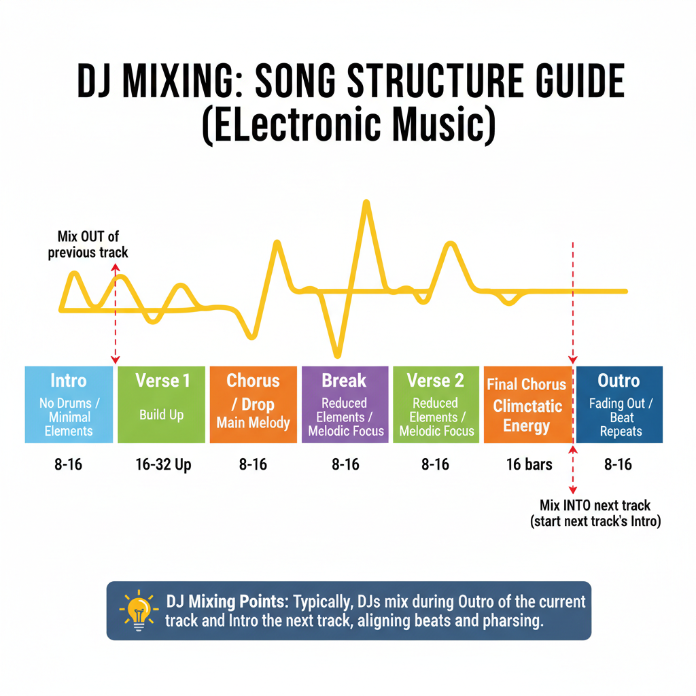

# Grundlagen
## Für absolute Anfänger mit Denon DN-S1200 & DN-X120

---

## DJ-Grundbegriffe verständlich erklärt

Bevor du mit dem Mixing beginnst, musst du folgende Begriffe verstehen:

### BPM (Beats Per Minute)

**BPM** ist die Anzahl der Schläge pro Minute – sozusagen das Tempo eines Tracks. 

Ein Track mit 120 BPM hat 120 Schläge pro Minute. 

**Warum ist das wichtig?** 
Damit zwei Tracks nahtlos ineinander übergehen, müssen ihre BPMs synchron sein. Tracks mit sehr unterschiedlichen BPMs (z.B. 100 BPM vs. 140 BPM) können nicht zusammen gemischt werden.

### Takt (Beat/Bar)

Der Takt ist die rhythmische Grundstruktur. 

In der elektronischen Musik verwenden wir meist **4/4-Takt**:
- 4 Schläge pro Takt
- Ein **Bar** besteht aus 4 Beats
- Zählen: 1, 2, 3, 4, 1, 2, 3, 4...

### Phrase

Eine **Phrase** ist eine musikalische Einheit, typischerweise:
- 8 Bars (8 x 4 Beats = 32 Beats)
- 16 Bars (16 x 4 Beats = 64 Beats)

**Warum wichtig?** 
DJs mischen ihre Tracks normalerweise am Ende einer Phrase ein – das klingt natürlich und fließend.

### Cue (Vorhören)

**Cue** bedeutet:
- Du hörst einen Track über deine **Kopfhörer**
- Der Track läuft NICHT über die Boxen (Publikum hört ihn nicht)
- Du kannst den nächsten Track vorbereiten, ohne dass es auffällt

Mit dem **Cue-Button** auf dem Mixer bestimmst du, ob ein Track über Kopfhörer oder Boxen läuft.

### Cue-Punkt

Ein **Cue-Punkt** ist eine Markierung an wichtigen Positionen:

- **Main Cue** = Anfang des Tracks (erste Beat)
- **Drop** = Wo die Energie explodiert
- **Break** = Wo die Musik ausdünnt
- **Outro** = Am Ende des Tracks

Mit Cue-Punkten kannst du schnell zu diesen Stellen springen.

### Gain (Eingangspegel)

**Gain** ist der Eingangspegel – wie laut ein Signal in den Mixer kommt.

**WICHTIG:** Das ist NICHT das gleiche wie die Lautstärke (Volume)!

- Der **Gain-Regler** bestimmt die **Signalstärke am Eingang**
- Der **Fader** bestimmt die **Lautstärke am Ausgang**

Gutes Gain-Staging verhindert Verzerrung und sorgt für klaren Sound.

### EQ (Equalizer)

Der **EQ** ist ein Werkzeug, um Frequenzbereiche zu kontrollieren:

- **Bass (Low)**: Tiefe Frequenzen (~60 Hz) - Kickdrum, tiefe Synthesizer
- **Midrange (Mid)**: Mittlere Frequenzen (~1 kHz) - Vocals, Melodien
- **Höhen (High)**: Hohe Frequenzen (~10-16 kHz) - Hi-Hats, Schellen, Details

Mit EQ-Reglern kannst du diese Bereiche anheben oder senken, um glatte Übergänge zu schaffen.

---

## Songaufbau verstehen

Professionelle elektronische Musik folgt einem bewährten Schema. Das Verständnis ist **entscheidend** für gutes DJing.

### Typischer Track-Aufbau (4-5 Minuten)

**1. Intro (8-16 Bars)**
- Der Track beginnt meist mit minimalem Inhalt
- Vielleicht nur ein Synthpuls oder die Kickdrum
- Perfekt für DJ-Übergänge!

**2. Verse / Aufbau 1 (16-32 Bars)**
- Erste größere Sektion
- Energie baut auf
- Mehr Elemente kommen hinzu (Bass, weitere Drums, Melodie)

**3. Drop / Chorus (8-16 Bars)**
- Der Höhepunkt!
- Hier sind ALLE Elemente präsent
- Maximale Energie – das ist der „Ohrwurm"

**4. Break / Überleitung (8-16 Bars)**
- Die Musik wird dünner
- Vielleicht nur Bass und Kicks
- Perfekte Stelle für Übergänge oder Effekte

**5. Verse / Aufbau 2 (16-32 Bars)**
- Ähnlich wie Verse 1
- Oft mit neuen Elementen oder Variation

**6. Finaler Drop (16 Bars)**
- Letzter großer Höhepunkt
- Oft noch intensiver als der erste

**7. Outro (8-16 Bars)**
- Der Track fade-outet
- Energie lässt nach
- Hier kannst du ausmischen oder den nächsten Track einleiten

### Wichtigste Regel für DJs:

**Mische deine Tracks am Ende einer Phrase ein – idealerweise am Ende von 8, 16 oder 32 Bars.**

Das klingt professionell und flüssig!

---

## Sync vs. manuelles Beatmatching

### Automatic Sync (Automatische Synchronisation)

Der DN-S1200 hat eine **Sync-Funktion**, die automatisch die BPMs zweier Tracks anpasst.

**Das ist praktisch, aber...**

Du solltest NICHT damit anfangen! 

**Warum?** Weil dein Gehör und dein Timing leiden werden.

### Manuelles Beatmatching (Die professionelle Methode)

Das ist die **richtige Art zu DJing**.

Beim manuellen Beatmatching nutzt du:
1. Den **Pitch-Fader** – um die Geschwindigkeit anzupassen
2. Das **Jog-Wheel** – für Feinabstimmungen
3. Dein **Gehör** – zum Kontrollieren

**Warum ist manuelles Beatmatching besser?**

- Du verstehst die Musik wirklich
- Du entwickelst echtes DJ-Handwerk
- Du kannst kreativer mischen
- Du bist nicht abhängig von Technik

**In dieser Anleitung konzentrieren wir uns auf manuelles Beatmatching.**

---

## Unterschiede der Musikstile (Tempo & Struktur)

Die Wahl des richtigen Genres macht einen großen Unterschied beim Mixen.

### Quick Genre Reference

| Genre | BPM | Charakter | Mixing |
|-------|-----|-----------|--------|
| **House** | 120-130 | Groovy, rhythmisch, tanzbar | Lange Übergänge |
| **Deep House** | 110-125 | Soulful, groovy, atmosphärisch | Lange Übergänge |
| **Progressive House** | 120-130 | Melodisch, subtile Aufbauten | Sehr lange Übergänge |
| **Electro House** | 128-135 | Energisch, aggressive Basslines | Kurze Übergänge |
| **Techno** | 120-140 | Minimalistisch, repetitiv, Druck | Saubere EQ-Arbeit |
| **Trance** | 128-150 | Melodisch, Spannungsaufbau | Spannungsaufbau vor Drops |
| **Goa** | 130-150 | Extrem melodisch, Energie-Fluss | Klare Phrasen, fließend |
| **Psytrance** | 135-150 | Schnelle Phrasen, Energie | Rhythmisches Beatmatching |
| **Hard Tekk** | 150-180+ | Extrem schnell, energiegeladen | Tempo-Kontrolle, schnelle Cuts |
| **Hardstyle** | 150-165 | Euphoric Kicks, Reverse-Bass | Schnelle BPM, klare Kicks |
| **Drum & Bass** | 160-180 | Schnelle Breakbeats, tiefe Bass | Kurze Übergänge, Präzision |
| **Dubstep** | 135-150 | Massive Basslines, aggressive Drops | Kreatives Timing der Drops |
| **Future Bass** | 80-120 | Harmonisch, melodisch, atmospheric | Harmonische Mixes |
| **Trap/EDM Trap** | 80-180 | Bass-dominant, variable Tempi | Präzise Bass-Übergänge |

**Anfänger-Tipp:** Starte mit **House-Musik (120-130 BPM)**. Sie hat:
- Die einfachste Struktur
- Die längsten, verzeihendsten Übergänge
- Das beste Fundament für Anfänger

---

*DJ-ANLEITUNG V2: GRUNDLAGEN — ABGESCHLOSSEN*
