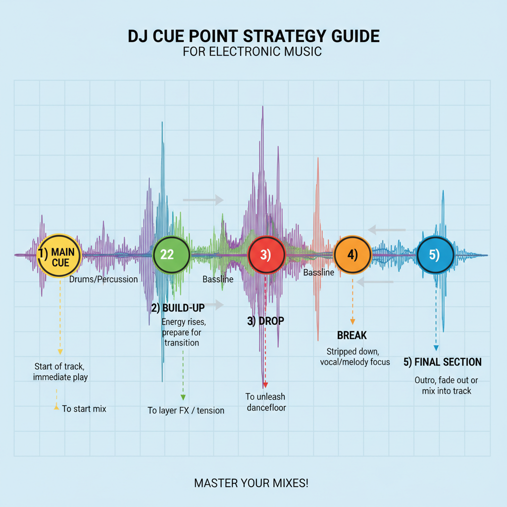

## Musik organisieren & sortieren

Professionelle DJs haben ihre Library **perfekt organisiert**. 

Das spart Zeit und verhindert peinliche Pausen.

### Ordner-Struktur

Erstelle folgende Struktur auf deinem USB-Stick:

```
DJ-Music/
├── House (120-130 BPM)
│   ├── Deep House
│   ├── Progressive House
│   └── Electro House
├── Techno (120-140 BPM)
│   ├── Minimal Techno
│   └── Tech House
├── Trance (128-150 BPM)
│   ├── Progressive Trance
│   └── Goa Trance
├── Hard (150+ BPM)
│   ├── Hardstyle
│   ├── Hard Tekk
│   └── Drum & Bass
└── Tools (für Übergänge)
    └── Breaks & Transitions
```

### Datei-Benennung

Benenne deine Tracks konsistent:

```
[BPM] - Artist - Title.mp3

Beispiele:
124 - Joel Corry - Head & Heart.mp3
130 - Eric Prydz - Generate.mp3
126 - John Summit - Deep In My Soul.mp3
```

**Vorteil:** Du erkennst sofort, ob zwei Tracks kompatibel sind!

### Weitere Tipps

- **Duplikate vermeiden**: Checke deine Library regelmäßig
- **Qualität prüfen**: Nutze nur MP3s mit mindestens 192 kbps oder WAVs
- **Favorites kennzeichnen**: Markiere deine liebsten Tracks
- **Backup machen**: Speichere deine Library auf einem zweiten USB-Stick

---

## BPM & Phrasen erkennen

Dies ist eine **kritische Fähigkeit** für DJs.

### BPM ermitteln

Der DN-S1200 hat einen **BPM-Counter**. So nutzt du ihn:

1. Lade einen Track
2. Drücke den **BPM-Auto-Button** – der Player analysiert automatisch
3. Das Display zeigt dir die **BPM-Zahl**

**Manuell prüfen:**
- Zähle die Beats beim Anhören
- Nutze einen **Metronom** oder **Tap-BPM-Funktion**
- Vergleiche mit ähnlichen Tracks

**Anfängerfehler:** 
Manche Tracks haben mehrere „Ebenen" von Beats. 
**Zähle immer den Hauptbeat** (meist die Kickdrum).

### Phrasen erkennen

Das ist schwieriger, aber du lernst es mit Übung:

1. **Beginne mit 16-Bar-Phrasen** – das ist Standard
2. **Zähle die Beats**: 1, 2, 3, 4 (wiederholt 4x) = 1 Phrase = 16 Bars
3. **Achte auf Veränderungen**: Wenn sich etwas ändert (neue Melodie, Kick kommt herein), ist eine Phrase vorbei
4. **Merke dir diese Positionen** – hier sind gute Übergangs-Punkte

**Praktische Übung:** 
Nimm dir einen Track vor und markiere die Phrasen mit einem Stift auf Papier. 

Nach 10-20 Tracks erkennst du die Muster automatisch.

---

## Cue-Punkte sinnvoll setzen

Cue-Punkte sind deine **Wegweiser** beim Auflegen. 

Professionelle DJs setzen systematisch Cue-Punkte für jeden Track.

### Die perfekte Cue-Punkt-Strategie



**1. Main Cue (Gelb/Standard)**
- Setze ihn am **ersten starken Beat** des Tracks
- Das ist meist am Anfang, aber manchmal auch nach einem längeren Intro
- **Warum:** Du weißt immer, wo der Track perfekt startet

**2. Build-Up Cue (Grün)**
- Setze ihn dort, wo die **Energie aufbaut**
- Hier fangen neue Instrumente an, die Kickdrum wird präsenter
- **Warum:** Perfekter Punkt, um Übergänge zu starten

**3. Drop Cue (Rot)**
- Setze ihn am **Peak/Höhepunkt** des Tracks
- Die volle Energie, alle Elemente präsent
- **Warum:** Guter Punkt für dramatische Drops oder Energiewechsel

**4. Break Cue (Orange)**
- Setze ihn dort, wo die **Musik ausdünnt**
- Bass und Kick verschwinden, vielleicht nur Melodie
- **Warum:** Kreative Mixing-Möglichkeiten, Filter-Einsätze

**5. Outro Cue (Blau)**
- Setze ihn am **Anfang des Outros**
- Wo die Energie wieder abnimmt zum Ausfaden
- **Warum:** Wissen, wo du ausmischen solltest

### Schritt-für-Schritt: Cue-Punkte setzen

1. Lade einen Track im DN-S1200
2. **Navigiere** durch den Track mit dem **Jog-Wheel**
3. Positioniere dich an einer wichtigen Stelle
4. Drücke den **Cue-Set Button** (mehrfach für verschiedene Punkte)
5. Der Cue-Punkt wird **gespeichert** (bleibt im Track)

**Anfänger-Tipp:** 
Setze mindestens **2 Cue-Punkte** pro Track:
- Main Cue (wo der Track startet)
- Drop oder Break (ein guter Mixing-Punkt)

---

## Vorbereitung für verschiedene Musikrichtungen

Verschiedene Genres brauchen unterschiedliche Vorbereitung:

### House-Musik vorbereiten

- Suche lange, sanfte Intros (ideal: 16-32 Bars reine Percussion)
- Setze Cue-Punkte auf den **Refrain** (oft der 8-Bar-Loop)
- Achte auf **Basslinien-Übergänge** (wichtig für Groove)

### Techno-Musik vorbereiten

- Techno ist minimalistischer – suche **Breaks** (wo Elemente wegfallen)
- Setze Cue-Punkte auf die **Beat-Veränderungen**
- Techno erlaubt **lange, saubere EQ-Übergänge**

### Trance-Musik vorbereiten

- Trance hat lange **Spannungsaufbauten**
- Setze Cue-Punkte auf die **Big Drops** (wo die Spannung explodiert)
- Achte auf **Melodie-Übergänge** (Trance ist melodisch)

### Schnelle Genres (Drum & Bass, Hardstyle) vorbereiten

- Diese Genres brauchen **präzise Beatmatching**
- Setze Cue-Punkte auf die **Breakbeats/Snare-Pattern-Veränderungen**
- Du brauchst mehr **Gehörtraining** (schneller Rhythmus ist schwer zu folgen)

---

*DJ-ANLEITUNG V2: TRACK-VORBEREITUNG — ABGESCHLOSSEN*
