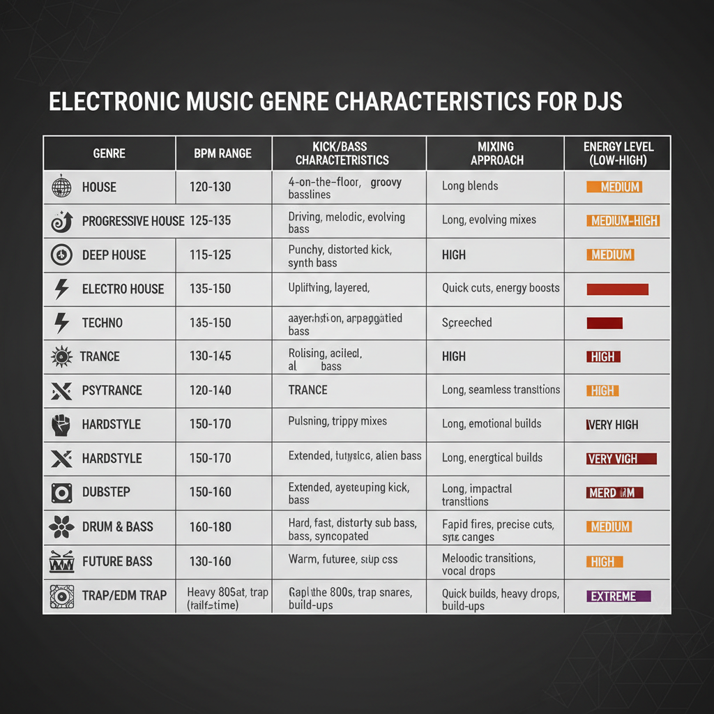
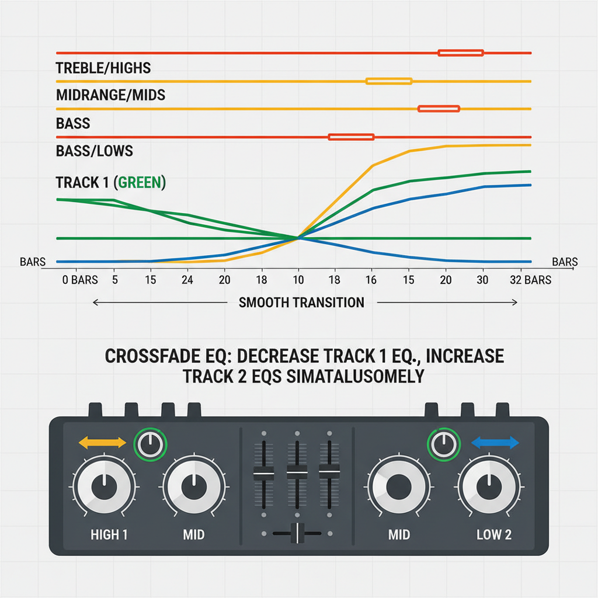

# Mixing-Techniken
## Beatmatching, EQ-Mixing, Übergänge und fortgeschrittene Techniken

---

## Manuelles Beatmatching am DN-S1200

Dies ist die **Kernfähigkeit** eines DJs. 

Ohne das schaffst du keine guten Übergänge.

### Die 5 Schritte zum Beatmatching



**Schritt 1: Höre die Master-BPM**

- Der erste Track läuft bereits über die Boxen (Master)
- Merke dir das **Tempo** (die Geschwindigkeit des Beats)
- Zähle die Beats: 1, 2, 3, 4, 1, 2, 3, 4...

**Schritt 2: Lade den neuen Track und erkenne seine BPM**

- Lade einen neuen Track im DN-S1200
- Nutze die **BPM-Auto-Erkennung** oder zähle manuell
- Drücke **Cue** – du hörst ihn über die Kopfhörer
- Vergleiche: Ist dieser Track schneller oder langsamer als der laufende?

**Schritt 3: Nutze den Pitch-Fader**

Der **Pitch-Fader** (ein langer Schieber) ändert die Geschwindigkeit:

- **Schiebe nach oben** = schneller (+)
- **Schiebe nach unten** = langsamer (-)
- Stelle den Fader so ein, dass beide BPMs **ungefähr gleich** sind

**Schritt 4: Feinabstimmung mit dem Jog-Wheel**

- Selbst wenn die BPMs gleich sind, können sie **leicht aus Phase** sein
- Nutze das **Jog-Wheel** für kleine Anpassungen
- **Bewege es leicht** – keine großen Bewegungen!
- Ziel: Der Beat des neuen Tracks ist **perfekt synchron** mit dem laufenden

**Schritt 5: Starte beim richtigen Moment**

- Achte auf die **Phrasen** (8 oder 16 Bars)
- Starte deinen neuen Track am **Anfang einer neuen Phrase**
- Das klingt natürlich und geplant

### Die kritischen Fehler vermeiden

❌ **Fehler 1:** Zu schnell den Fader bewegen – keine feinen Anpassungen machen

✅ **Lösung:** Langsam, kleine Schritte, Gehör nutzen

❌ **Fehler 2:** Nicht auf die Phrasen achten – startest mitten in einer Phrase

✅ **Lösung:** Zähle mindestens 8 Bars, bevor du startest

❌ **Fehler 3:** Nur auf die Kopfhörer verlassen – kannst nicht sehen, ob es synchron ist

✅ **Lösung:** Nutze auch dein Gefühl und beobachte die Waveform (falls vorhanden)

### Übung: Beatmatching trainieren

**Leichte Übung:**
- Wähle zwei Tracks der **gleichen BPM** (z.B. beide 124 BPM)
- Beatmatch sie
- Das sollte sehr einfach sein

**Mittlere Übung:**
- Wähle zwei Tracks, die **3-5 BPM unterschiedlich** sind (z.B. 120 vs. 125)
- Das erfordert mehr Pitch-Fader-Bewegung

**Schwere Übung:**
- Wähle zwei Tracks, die **stark unterschiedlich** sind (z.B. 110 vs. 135)
- Das ist schwer, aber möglich
- Braucht viel Gefühl und Gehörtraining

---

## Übergänge mit EQ-Mixing

Dies ist die **professionelle Technik** für glatte Übergänge. 

Nicht nur den Fader bewegen – das klingt amateurhaft!

### Die 3-Band EQ verstehen

Der DN-X120 hat einen **3-Band EQ** pro Kanal:

- **Bass (Low)**: Tiefe Frequenzen (~60 Hz)
- **Mids (Mid)**: Mittlere Frequenzen (~1 kHz)
- **Treble (High)**: Hohe Frequenzen (~10-16 kHz)

Jeder kann von **-40 dB bis +10 dB** angepasst werden. 

Das ist eine **massive Reichweite**.

### Die EQ-Mixing-Technik (Sanfte Übergänge)

Dies ist die Standard-Technik für lange, sanfte Übergänge (z.B. in Progressive House):



**Phase 1: Vorbereitung** (vor dem Mix)

- Der laufende Track hat **normale EQ-Einstellung** (alles auf 0)
- Der neue Track ist bereit mit **alle EQ-Knöpfe nach links** (ca. -20 dB)
- Der neue Track läuft über Kopfhörer, mit **Fader ganz unten**

**Phase 2: Start** (Beats sind synchron)

- Schiebe den **Channel Fader** des neuen Tracks langsam **nach oben**
- Der neue Track wird leiser und leiser hörbar (mit reduziertem EQ)

**Phase 3: EQ-Austausch** (der Hauptteil, über 16-32 Bars)

Beginne mit den **Mitten (Mids)**:
- Drehe die Mids des **laufenden Tracks** nach links (Mids reduzieren)
- Drehe gleichzeitig die Mids des **neuen Tracks** nach rechts (Mids erhöhen)

Dann die **Höhen (Treble)**:
- Reduziere die Höhen des laufenden Tracks
- Erhöhe die Höhen des neuen Tracks

Zuletzt die **Bässe (Bass)** – DAS IST DER WICHTIGSTE TEIL:
- Dies ist der wichtigste Teil – die Kickdrum sitzt hier!
- Reduziere den Bass des laufenden Tracks
- Erhöhe den Bass des neuen Tracks

**Phase 4: Finale** (20-40 Takte später)

- Der neue Track klingt jetzt wie der Master
- Der alte Track ist vollständig reduziert
- Schiebe den **Channel Fader** des alten Tracks nach **unten**
- Der Mix ist komplett

---

## Lautstärke-Übergänge (Volume Fading)

Manchmal reichen **nur die Fader** – keine EQ nötig.

### Einfaches Volume Crossfade

1. **Beatmatch** die beiden Tracks
2. Schiebe den **Channel Fader des neuen Tracks** von unten nach oben
3. **Gleichzeitig** schiebst du den **Fader des laufenden Tracks** von oben nach unten
4. Die zwei Fader kreuzen sich – daher „Crossfade"

**Nachteil:** Das klingt oft zu simpel und zu schnell. 

Nutze das nur für:
- Sehr schnelle Übergänge (Scratch-Übergänge)
- Genres, wo das passt (Drum & Bass, Hardstyle)

---

## Kurze vs. lange Übergänge

### Lange Übergänge (32-64 Bars)

- **Genrepassend:** House, Progressive House, Techno
- **Vorteil:** Sehr smooth und professionell
- **Nachteil:** Braucht viel Aufmerksamkeit und Zeit
- **Technik:** Nutze EQ-Mixing, schrittweise Fader-Bewegungen

**Beispiel-Timing:**
```
Bars 1-16:   Neue Mitten einbringen, alte reduzieren
Bars 17-32:  Neue Höhen einbringen, alte reduzieren
Bars 33-48:  Neue Bässe einbringen, alte reduzieren
Bars 49-64:  Finale Anpassungen, alte Track ausblenden
```

### Kurze Übergänge (8-16 Bars)

- **Genrepassend:** Electro House, Hardstyle, Drum & Bass
- **Vorteil:** Energisch und dramatisch
- **Nachteil:** Weniger Zeit für Fehlerkorrektur
- **Technik:** Schnellere EQ-Bewegungen, schneller Fader-Crossfade

**Beispiel-Timing:**
```
Bars 1-4:    EQ schnell umschalten
Bars 5-8:    Fader crossfaden
Bars 9-12:   Neue Track läuft dominant
Bars 13-16:  Finale Justierung
```

---

## Kreative Übergänge (Basics)

Über EQ und Fader hinaus gibt es kreative Techniken:

### Filter-Übergänge

Der DN-S1200 hat einen **High-Pass und Low-Pass Filter** (im Effekt-Menü):

**High-Pass Filter:**
- Reduziert die **tiefen Frequenzen** progressiv
- Nutzen: Entferne den Bass des alten Tracks, um den Bass des neuen hervorzuheben
- Effekt: Der alte Track wird immer dünner

**Low-Pass Filter:**
- Reduziert die **hohen Frequenzen** progressiv
- Nutzen: Entferne die Höhen des alten Tracks
- Effekt: Der alte Track wird immer dumpfer

### Loop-Übergänge

Der DN-S1200 hat **Seamless Looping**:

1. Setze einen **Loop-Punkt** am Anfang einer Phrase (z.B. Bar 1)
2. Setze **Loop-Out** am Ende der Phrase (z.B. Bar 8)
3. Der Loop wiederholt sich endlos
4. **Nutze diese Zeit** um den neuen Track perfekt zu beatmatchen
5. Starte den neuen Track am Ende einer Loop-Wiederholung

**Vorteil:** Du hast Zeit, dich vorzubereiten, ohne dass es auffällt!

### Reverb-Übergänge

Manche DJ-Mixer haben **eingebaute Effekte**. Der DN-S1200 hat:

- **Reverb/Echo**: Künstliche Raumklang-Effekte
- **Flanger**: Sweep-Effekt
- **Brake**: Verlangsamt den Track wie eine bremste Schallplatte

**Kreative Nutzung:**
- Nutze **Echo** auf dem alten Track beim Ausblenden – klingt professionell
- Nutze **Brake** für dramatische Übergänge in House/Techno

---

## Feinkorrektionen mit Jogwheel & Pitch

### Jog-Wheel: Die "Echtzeit-Steuerung"

Das **110mm Touch-Sensitive Jog-Wheel** des DN-S1200 ist dein beste Freund:

**Beatmatching-Modus:**
- Drehe das Jog-Wheel leicht, um die **Pitch (Geschwindigkeit) minimal anzupassen**
- Nutze es für **Feinabstimmungen**, wenn die BPMs fast synchron sind
- **Kleine, sanfte Bewegungen** – keine wild drehen!

**Pitch-Bending-Modus:**
- Schiebe den **Pitch-Range-Schalter** auf eine größere Range
- Nutze das Jog-Wheel für **dramatische Pitch-Veränderungen**
- Effekt: Schleife von schnell zu langsam (kreativ)

### Pitch-Regler verstehen

Der **Pitch-Fader** des DN-S1200 hat mehrere Modi:

- **4% Range**: Sehr genaue Kontrolle für kleine Anpassungen
- **10% Range**: Mehr Bewegungsfreiheit
- **16% Range**: Standard für die meisten DJ-Gigs
- **24%, 50%, 100%**: Für kreative, dramatische Pitch-Änderungen

**Anfänger-Empfehlung:** 
Starte mit **10% Range** – das gibt dir genug Kontrolle ohne zu sensibel zu sein.

---

## Mixing ohne Effekte als Grundlage

Bevor du mit Effekten spielst, musst du **saubere Basis-Mixing-Skills** haben:

### Die 5 Kernelemente des Clean Mixing

1. **Beatmatching**: BPMs sind synchron
2. **Phrase-Timing**: Startest am Anfang einer Phrase
3. **EQ-Arbeit**: Frequenzen sind ausgewogen
4. **Level-Control**: Pegel sind optimal (nicht clippen, nicht zu leise)
5. **Gehörtraining**: Du entwickelst ein „Ohr" für gute Übergänge

### Üben ohne Effekte

Verbringe deine **erste Woche** nur mit diesen 5 Elementen:

- **Tag 1-2:** Beatmatching üben (ohne Übergang)
- **Tag 3-4:** Phrase-Timing trainieren
- **Tag 5-6:** EQ-Mixing lernen
- **Tag 7+:** Alle zusammen kombinieren

**Warum?** Effekte sind **Zutat**, nicht die **Hauptspeise**. Ein gutes Fundament ist wichtiger.

---

## Typische Übergangsfehler und deren Vermeidung

### Fehler 1: Phasen-Fehler (Out of Phase)

**Problem:** Die Beats der zwei Tracks laufen nicht synchron – es klingt verwaschen.

**Ursache:** Der Pitch-Fader ist nicht genau genug eingestellt, oder der neue Track wird zu früh gestartet.

**Lösung:**
- Nutze das **Jog-Wheel** für feine Anpassungen
- Starte den Track **später** – nicht beim ersten Beat
- Trainiere dein Gehör mit Headphones

---

### Fehler 2: BPM-Differenzen nicht erkannt

**Problem:** Du beatmatchst zwei Tracks mit 115 vs. 125 BPM – das funktioniert nie!

**Ursache:** Du hast die BPMs nicht überprüft.

**Lösung:**
- Nutze IMMER die **BPM-Auto-Erkennung** oder zähle manuell
- Vergleiche BPMs **bevor** du ein Set planst
- Anfänger: Wähle Tracks mit gleicher oder sehr ähnlicher BPM

---

### Fehler 3: Falsche Pegel-Einstellung

**Problem:** Der neue Track ist viel lauter/leiser als der alte – klingt unprofessionell.

**Ursache:** Die Gain-Regler sind nicht richtig eingestellt (Fehler in der Vorbereitung).

**Lösung:**
- Alle Tracks sollten **auf gleiche Lautstärke normalisiert** sein (Gain-Staging)
- Überprüfe die **Level-Meter** bevor du startest
- Im Zweifelsfall: Etwas leiser als zu laut

---

### Fehler 4: Zu lange/zu kurze Übergänge

**Problem:** Der Übergang wirkt langweilig oder gehetzt.

**Ursache:** Du kennst die **Phrasen-Struktur** nicht gut genug.

**Lösung:**
- Zähle die Bars beim Üben
- Merke dir: 8, 16 oder 32 Bars sind Standard
- Passe die Übergangslänge ans Genre an

---

### Fehler 5: EQ nicht genutzt

**Problem:** Deine Übergänge klingen simpel und amateurhaft.

**Ursache:** Du machst nur Volume-Crossfade ohne EQ.

**Lösung:**
- **IMMER** EQ-Mixing verwenden
- Bass-Übergang ist am wichtigsten (Kickdrum!)
- Übe EQ-Übergänge bis es automatisch wird

---

## Zusätzliche Mixing-Techniken

### Layering von Percussion/Loops

**Layering** bedeutet, **mehrere Elemente übereinander zu spielen**, um eine reichere Textur zu schaffen.

1. Finde einen Track mit **prominenten Percussion**
2. Setze einen **Loop** auf 4-8 Bars
3. Überlagere den Loop leise **im Hintergrund**
4. Nutze EQ: Der Layer braucht nicht die volle Basslinie – nur die Höhen/Mitten

### Sanftes Ein- und Ausblenden

**Smooth Fade-In:**
1. Track beginnt mit **Fader ganz unten**
2. Schiebe den Fader langsam nach oben (**über 4-8 Bars**)
3. Der Track wird allmählich lauter

**Smooth Fade-Out:**
1. Track läuft normal
2. Schiebe den Fader langsam nach unten (**über 8-16 Bars**)
3. Der Track wird allmählich leiser bis zur Stille

---

*DJ-ANLEITUNG V2: MIXING-TECHNIKEN — ABGESCHLOSSEN*
